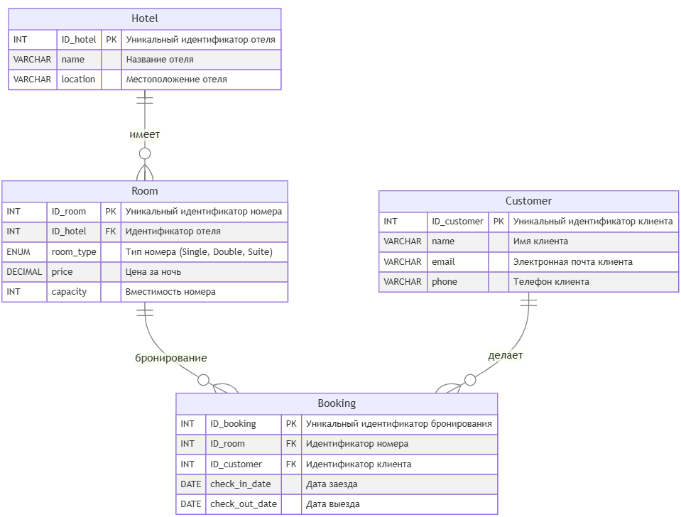

# БД "Бронирование отелей"

## ER-диаграмма

---

## Задача 1

**Условие**

Определить, какие клиенты сделали более двух бронирований в разных отелях, и вывести информацию о каждом таком клиенте, включая его имя, электронную почту, телефон, общее количество бронирований, а также список отелей, в которых они бронировали номера (объединенные в одно поле через запятую с помощью CONCAT). Также подсчитать среднюю длительность их пребывания (в днях) по всем бронированиям. Отсортировать результаты по количеству бронирований в порядке убывания.

**Ожидаемый вывод для тестовых данных**

| Bob Brown | bob.brown@example.com | +2233445566 | 3 | Grand Hotel, Ocean View Resort | 3.0000 |
| --- | --- | --- | --- | --- | --- |
| Ethan Hunt | ethan.hunt@example.com | +5566778899 | 3 | Mountain Retreat, Ocean View Resort | 3.0000 |

### [Решение](task1.sql)

-----------
-----------

## Задача 2

**Условие**

Необходимо провести анализ клиентов, которые сделали более двух бронирований в разных отелях и потратили более 500 долларов на свои бронирования. Для этого:

- Определить клиентов, которые сделали более двух бронирований и забронировали номера в более чем одном отеле. Вывести для каждого такого клиента следующие данные: ID\_customer, имя, общее количество бронирований, общее количество уникальных отелей, в которых они бронировали номера, и общую сумму, потраченную на бронирования.
- Также определить клиентов, которые потратили более 500 долларов на бронирования, и вывести для них ID\_customer, имя, общую сумму, потраченную на бронирования, и общее количество бронирований.
- В результате объединить данные из первых двух пунктов, чтобы получить список клиентов, которые соответствуют условиям обоих запросов. Отобразить поля: ID\_customer, имя, общее количество бронирований, общую сумму, потраченную на бронирования, и общее количество уникальных отелей.
- Результаты отсортировать по общей сумме, потраченной клиентами, в порядке возрастания.

**Ожидаемый вывод для тестовых данных**

| ID\_customer | name | total\_bookings | total\_spent | unique\_hotels |
| --- | --- | --- | --- | --- |
| 4 | Bob Brown | 3 | 820.00 | 2 |
| 7 | Ethan Hunt | 3 | 850.00 | 2 |

### [Решение](task2.sql)

-----------
-----------

## Задача 3

**Условие**

Вам необходимо провести анализ данных о бронированиях в отелях и определить предпочтения клиентов по типу отелей. Для этого выполните следующие шаги:

1. Категоризация отелей.
    Определите категорию каждого отеля на основе средней стоимости номера:

    - «Дешевый»: средняя стоимость менее 175 долларов.
    - «Средний»: средняя стоимость от 175 до 300 долларов.
    - «Дорогой»: средняя стоимость более 300 долларов.
2. Анализ предпочтений клиентов.
    Для каждого клиента определите предпочитаемый тип отеля на основании условия ниже:

    - Если у клиента есть хотя бы один «дорогой» отель, присвойте ему категорию «дорогой».
    - Если у клиента нет «дорогих» отелей, но есть хотя бы один «средний», присвойте ему категорию «средний».
    - Если у клиента нет «дорогих» и «средних» отелей, но есть «дешевые», присвойте ему категорию предпочитаемых отелей «дешевый».
3. Вывод информации.
    Выведите для каждого клиента следующую информацию:

    - ID\_customer: уникальный идентификатор клиента.
    - name: имя клиента.
    - preferred\_hotel\_type: предпочитаемый тип отеля.
    - visited\_hotels: список уникальных отелей, которые посетил клиент.
4. Сортировка результатов.
    Отсортируйте клиентов так, чтобы сначала шли клиенты с «дешевыми» отелями, затем со «средними» и в конце — с «дорогими».

**Ожидаемый вывод для тестовых данных**

| ID\_customer | name | preferred\_hotel\_type | visited\_hotels |
| --- | --- | --- | --- |
| 10 | Hannah Montana | Дешевый | City Center Inn |
| 1 | John Doe | Средний | City Center Inn,Grand Hotel |
| 2 | Jane Smith | Средний | Grand Hotel |
| 3 | Alice Johnson | Средний | Grand Hotel |
| 4 | Bob Brown | Средний | Grand Hotel,Ocean View Resort |
| 5 | Charlie White | Средний | Ocean View Resort |
| 6 | Diana Prince | Средний | Ocean View Resort |
| 7 | Ethan Hunt | Дорогой | Mountain Retreat,Ocean View Resort |
| 8 | Fiona Apple | Дорогой | Mountain Retreat |
| 9 | George Washington | Дорогой | City Center Inn,Mountain Retreat |

### [Решение](task3.sql)

-----------
-----------

